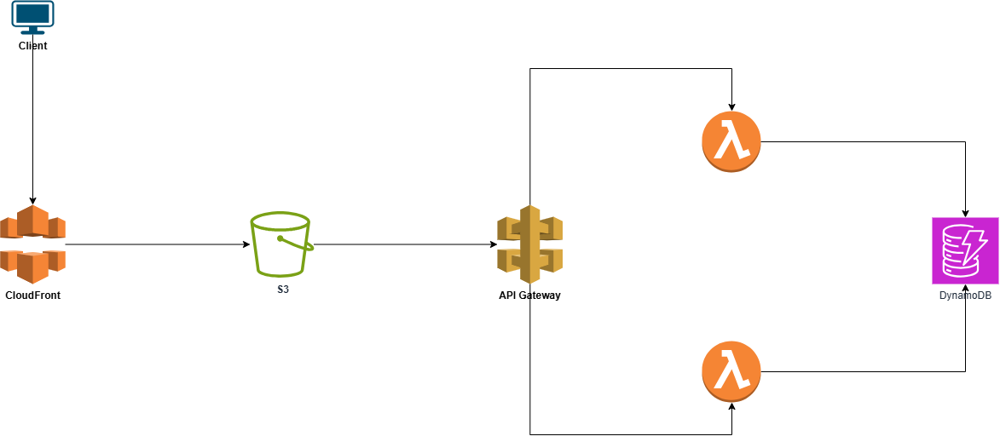

# Simple Logging Service Infrastructure

This project sets up a serverless logging service on AWS using S3 and Lambda, API gateway and DynamoDB.

This project implements a **secure, serverless logging platform on AWS**, designed for scalable log ingestion and retrieval. It follows cloud-native best practices including:

- **Infrastructure as Code (Terraform)**
- **CI/CD using GitHub Actions**
- **Least privilege IAM roles**
- **Encrypted data at rest and in transit**
- **Security scanning integrated into the pipeline**

It allows clients or applications to send logs via an API, which are processed by Lambda functions and stored in DynamoDB for efficient querying. A frontend (optional) can also visualize logs by querying the API.

## Architecture Diagram



<sup>_Diagram: CloudFront ➝ S3 (Frontend) ➝ API Gateway ➝ Lambda ➝ DynamoDB (Storage)_</sup>

## Project Structure

| Component               | Description                                      |
|------------------------|--------------------------------------------------|
| `simple-log-service-infra` | Terraform code and GitHub Actions pipelines       |
| `simple-log-service`       | Source code: Lambda functions & frontend (if any) |

The components are built and deployed using GitHub Actions CI/CD pipeline with security checks, least privilege IAM roles, and encrypted data handling. To deploy run:

- Workflow: build_deploy_ecr manually

## Features

- Secure AWS Lambda with encrypted data
- Infrastructure as Code (Terraform)
- CI/CD with GitHub Actions
- Pipeline security checks (tfsec, trivy, gitleaks)
- Docker image build + push to ECR
- OIDC-based GitHub authentication to AWS (no static keys)
- Least privilege IAM policies

## How to Deploy

### 1️. Prerequisites

- AWS Account (Admin role for setup)
- GitHub Repository connected to AWS via OIDC
- Terraform and Docker installed locally (optional for dev)
- Secrets added to GitHub repository:
  - `AWS_REGION`
  - `AWS_ROLE_ARN`
  - 'TOKEN'
  - 'AWS_ACCOUNT'

---

### 2. Setup AWS OIDC Role for GitHub Actions

1. Create an IAM role with the following trust policy:
   ```json
   {
     "Effect": "Allow",
     "Principal": {
       "Federated": "arn:aws:iam::<AWS_ACCOUNT_ID>:oidc-provider/token.actions.githubusercontent.com"
     },
     "Action": "sts:AssumeRoleWithWebIdentity",
     "Condition": {
       "StringLike": {
         "token.actions.githubusercontent.com:sub": "repo:<your-username>/<your-repo>:*"
       }
     }
   }

Attach a least privilege policy to allow:
- Lambda deployments
- DynamoDB and API Gateway updates
- ECR push/pull access
- Terraform resource creation
- (Optional) Secrets Manager or CloudWatch access

Save the Role ARN and add it to GitHub as AWS_ROLE_ARN.

#### Running the CI/CD Workflow

To deploy your infrastructure and application:

- Go to your GitHub repository: **simple-log-service-infra** 
- Open the Actions tab
- Locate the **build_deploy_ecr** workflow
- Click "Run workflow" (manual trigger)

#### This will:

- Build Docker images (e.g., for Lambda functions)
- Run tfsec, trivy, gitleaks
- Push images to ECR
- Deploy infrastructure and Lambda functions

## Testing & Observability

- View logs in CloudWatch Logs
- (Optional) Enable AWS X-Ray for tracing

**Perform health checks using curl or Postman**

curl -X POST https://<api-id>.execute-api.<region>.amazonaws.com/{stage}/write \
  -d '{"message": "Service Started"}'

curl https://<api-id>.execute-api.<region>.amazonaws.com/{stage}/read


